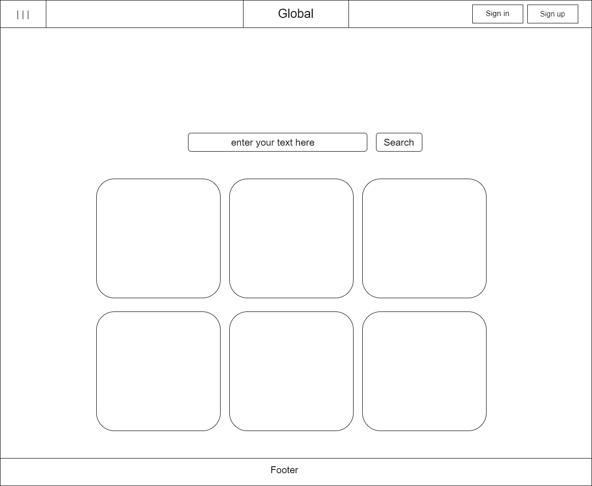
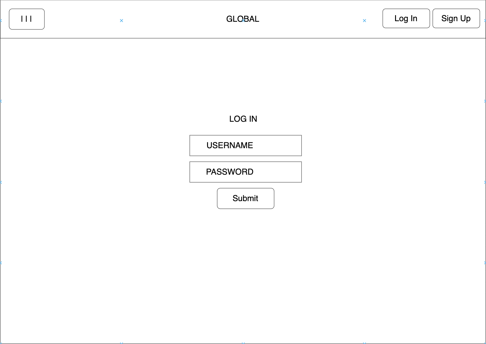
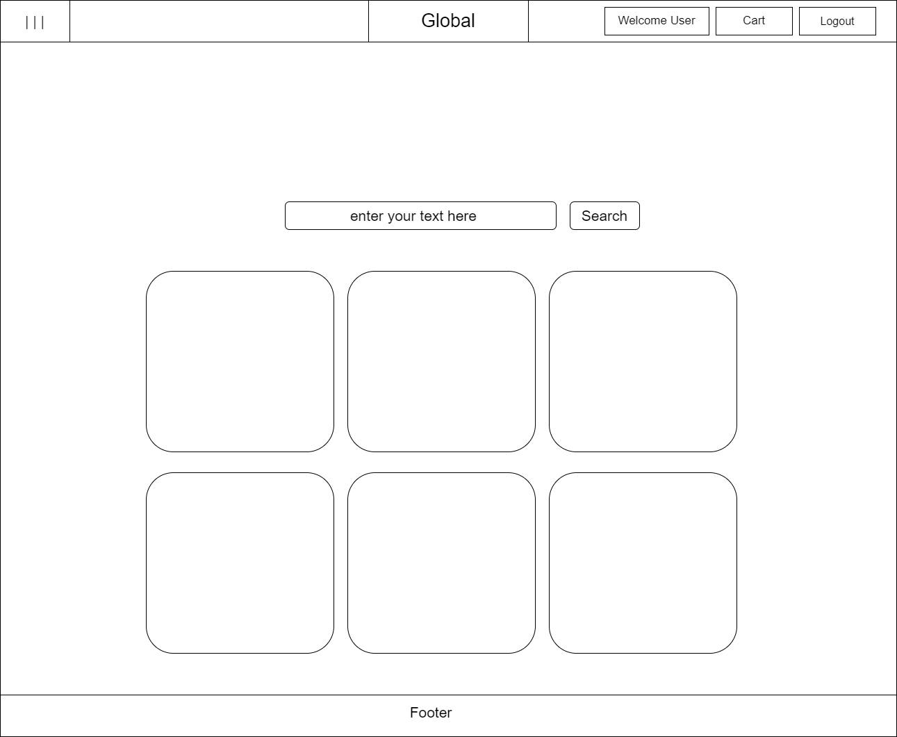
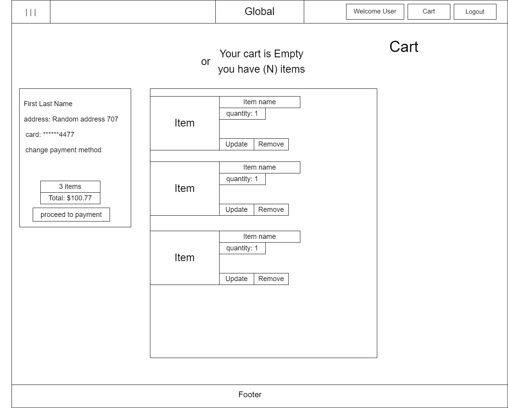
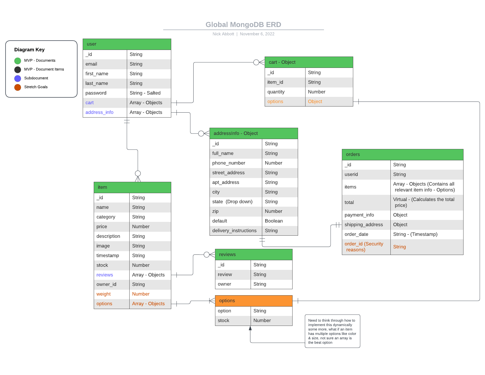

## Technolgies Used
 - [Javascript](https://www.javascript.com/)
  - [ReactJS](https://reactjs.org/)
    - Virtual DOM. This characteristic of React helps to speed up the app development process and offers  flexibility
  - [React Hooks](https://reactjs.org/docs/hooks-intro.html)
    - Hooks are a new addition in React 16.8. They let you use state and other React features without writing a class.
  - [Bootstrap](https://getbootstrap.com/)
    - Bootstrap is a powerful, feature-packed frontend toolkit. Build anything—from prototype to production—in minutes
  - [HTML](https://html.spec.whatwg.org/)
    - HTML is the standard markup language for Web pages.
    - With HTML you can create your own Website.
  - [CSS](https://www.w3.org/Style/CSS/Overview.en.html)
    - CSS is the language we use to style an HTML document.
    - CSS describes how HTML elements should be displayed.
  - [Stripe API](https://stripe.com/docs/api)
    - Digital payment processing

## Wireframes

## Database ERD (Entity Relationship Diagram)

## Front End(Client)

- [API-imports]
    - user routes
    - item routes
    - cart routes

- [Components]
    - user
    - cart
    - items

- [Pages]
    - main page
    - auth pages(sign-up,-in,-out)
    - cart page
    - profile page(personal info)
    - page to add items to sell
    - page to browse and search items for purchase
    